# 百度贴吧功能思维导图

## 项目概述
百度贴吧是一个基于兴趣的社区平台，用户可以在不同的贴吧中交流分享。本项目包含10个核心页面，采用前后端分离架构，前端使用HTML/CSS/JavaScript，后端使用Django+DRF。

## 功能架构总览

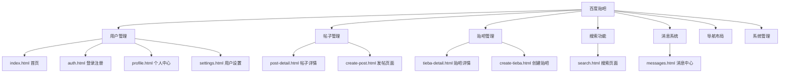

## 1. 用户管理模块

### 1.1 用户注册系统
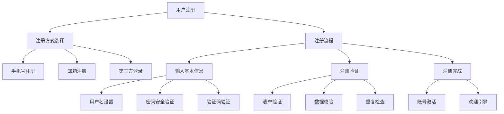

### 1.2 用户登录系统
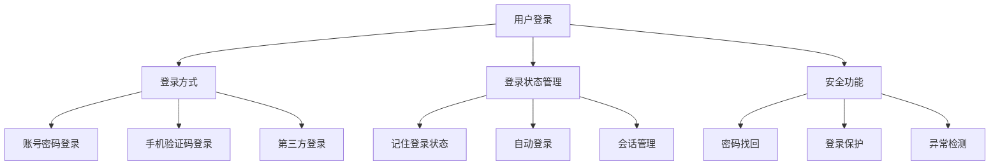

### 1.3 个人中心管理
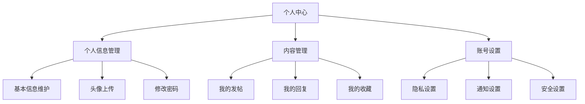

### 1.4 权限管理系统
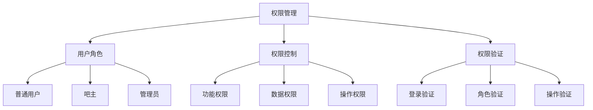

## 2. 帖子管理模块

### 2.1 帖子发布系统
```mermaid
graph TD
    C1[帖子发布] --> C1_1[发布准备]
    C1_1 --> C1_1_1[选择贴吧分类]
    C1_1 --> C1_1_2[设置帖子标题]
    C1_1 --> C1_1_3[选择发布类型]
    
    C1 --> C1_2[内容编辑]
    C1_2 --> C1_2_1[富文本编辑器]
    C1_2 --> C1_2_2[图片上传功能]
    C1_2 --> C1_2_3[表情功能]
    C1_2 --> C1_2_4[@好友功能]
    
    C1 --> C1_3[发布设置]
    C1_3 --> C1_3_1[权限设置]
    C1_3 --> C1_3_2[标签设置]
    C1_3 --> C1_3_3[定时发布]
```

### 2.2 帖子浏览系统
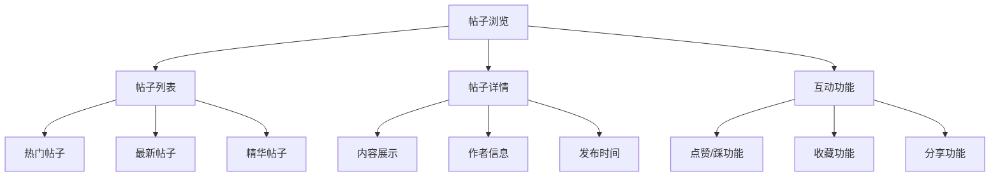

### 2.3 评论回复系统
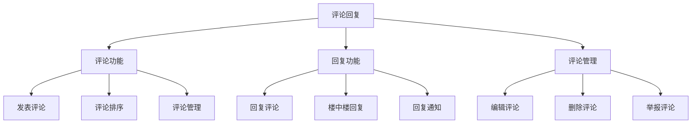

### 2.4 帖子管理系统
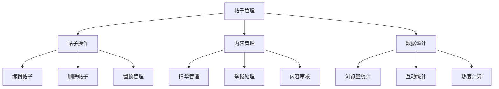

## 3. 贴吧管理模块

### 3.1 贴吧创建系统
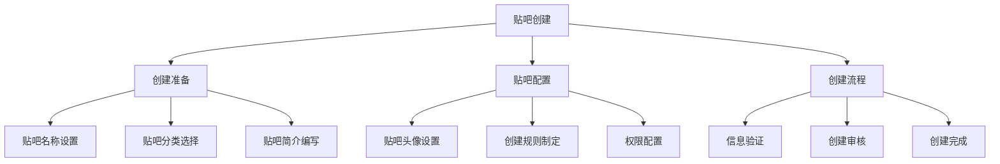

### 3.2 贴吧管理系统
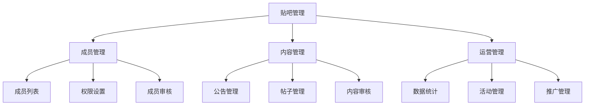

### 3.3 贴吧浏览系统
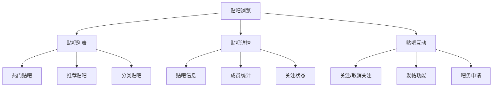

## 4. 搜索功能模块

### 4.1 搜索系统
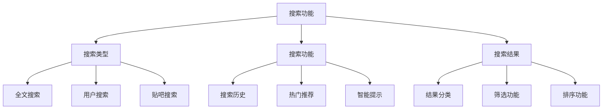

### 4.2 推荐系统
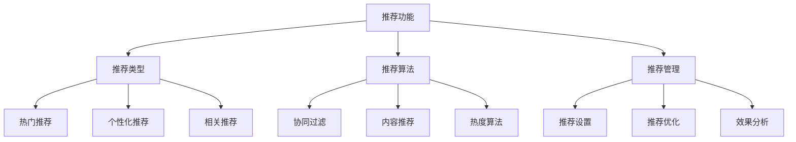

## 5. 消息系统模块

### 5.1 通知系统
```mermaid
graph TD
    F1[通知系统] --> F1_1[通知类型]
    F1_1 --> F1_1_1[系统通知]
    F1_1 --> F1_1_2[评论回复]
    F1_1 --> F1_1_3[@消息]
    
    F1 --> F1_2[通知管理]
    F1_2 --> F1_2_1[通知设置]
    F1_2 --> F1_2_2[消息阅读]
    F1_2 --> F1_2_3[消息删除]
    
    F1 --> F1_3[推送功能]
    F1_3 --> F1_3_1[实时推送]
    F1_3 --> F1_3_2[批量推送]
    F1_3 --> F1_3_3[定时推送]
```

### 5.2 私信系统
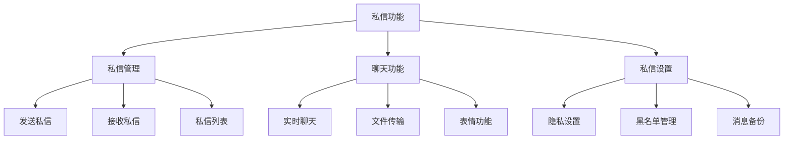

## 6. 导航布局模块

### 6.1 页面导航系统
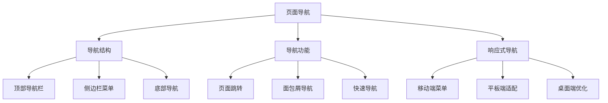

### 6.2 布局系统
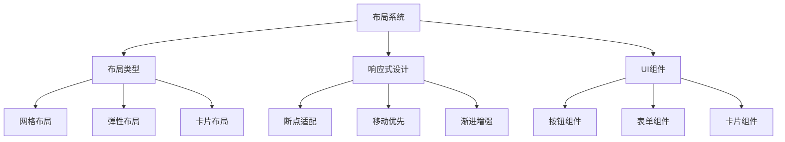

## 7. 系统管理模块

### 7.1 后台管理系统
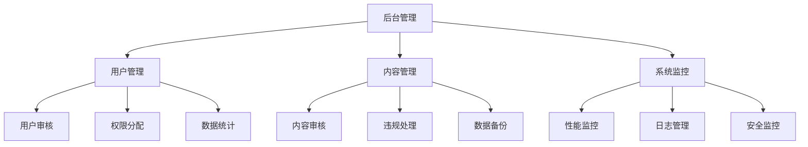

### 7.2 数据统计系统
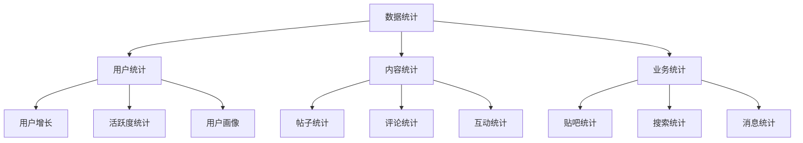

## 功能模块关联图

```mermaid
graph TB
    A[百度贴吧项目]
    
    B[用户管理模块]
    C[帖子管理模块]
    D[贴吧管理模块]
    E[搜索功能模块]
    F[消息系统模块]
    G[导航布局模块]
    H[系统管理模块]
    
    A --> B
    A --> C
    A --> D
    A --> E
    A --> F
    A --> G
    A --> H
    
    B --> C
    B --> D
    B --> F
    
    C --> D
    C --> E
    C --> F
    
    D --> C
    D --> E
    D --> F
    
    E --> C
    E --> D
    
    F --> B
    F --> C
    
    G --> B
    G --> C
    G --> D
    G --> E
    G --> F
    
    H --> B
    H --> C
    H --> D
    H --> E
    H --> F
    H --> G
```

## 技术实现架构

### 前端技术栈
- **框架**: Veaury (Vue + React混合开发)
- **样式**: CSS3 + Flexbox/Grid布局
- **交互**: JavaScript ES6+
- **存储**: LocalStorage + SessionStorage

### 后端技术栈
- **框架**: Django + Django REST Framework
- **数据库**: MySQL + Redis
- **认证**: JWT Token
- **部署**: Docker容器化

### 系统特性
- **响应式设计**: 支持多端适配
- **模块化开发**: 功能模块独立
- **组件化架构**: 可复用组件设计
- **性能优化**: 懒加载 + 缓存策略

## 总结

本功能思维导图全面展示了百度贴吧项目的功能架构，涵盖了从用户注册登录到内容管理、从贴吧运营到系统管理的完整功能体系。每个功能模块都进行了详细分解，并通过流程图展示了功能之间的关联关系，为项目开发和维护提供了清晰的指导。