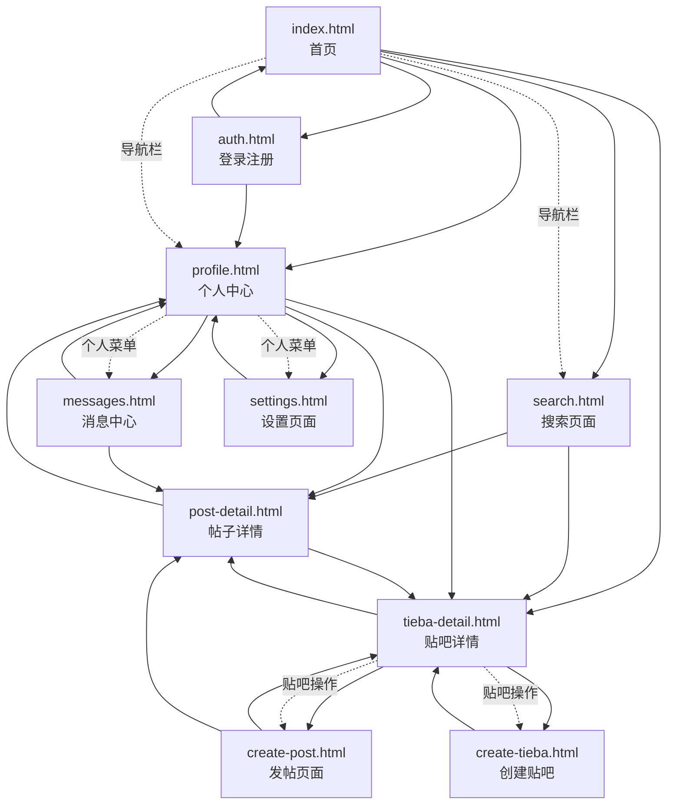

# 百度贴吧项目页面调用关系图

## 项目概述
本项目包含10个核心页面，涵盖了百度贴吧的主要功能模块。以下是各页面之间的调用关系和导航流程。

## 页面列表

### 核心页面（8个）
1. **index.html** - 首页
2. **auth.html** - 登录/注册页面
3. **profile.html** - 个人中心页面
4. **tieba-detail.html** - 贴吧详情页面
5. **post-detail.html** - 帖子详情页面
6. **search.html** - 搜索页面
7. **messages.html** - 消息中心页面
8. **create-post.html** - 帖子创建页面

## 页面调用关系图

### Mermaid流程图



### 详细调用关系说明

#### 1. 首页 (index.html)
- **主要功能**: 展示热门贴吧、推荐帖子、导航入口
- **调用关系**:
  - → auth.html (登录/注册)
  - → search.html (搜索功能)
  - → tieba-detail.html (点击贴吧进入)
  - → profile.html (用户中心)

#### 2. 登录/注册页面 (auth.html)
- **主要功能**: 用户认证、注册新账户
- **调用关系**:
  - → index.html (登录成功后跳转首页)
  - → profile.html (登录后进入个人中心)

#### 3. 个人中心 (profile.html)
- **主要功能**: 用户信息管理、内容管理
- **调用关系**:
  - → messages.html (消息中心)
  - → tieba-detail.html (管理的贴吧)
  - → post-detail.html (发布的帖子)

#### 4. 贴吧详情页 (tieba-detail.html)
- **主要功能**: 贴吧信息展示、帖子列表、贴吧操作
- **调用关系**:
  - → post-detail.html (点击帖子进入详情)
  - → create-post.html (发帖功能)
  - → create-tieba.html (创建新贴吧)

#### 5. 帖子详情页 (post-detail.html)
- **主要功能**: 帖子内容展示、评论功能、互动操作
- **调用关系**:
  - → tieba-detail.html (返回贴吧)
  - → profile.html (查看作者信息)

#### 6. 搜索页面 (search.html)
- **主要功能**: 全局搜索、结果筛选、分类浏览
- **调用关系**:
  - → tieba-detail.html (搜索到的贴吧)
  - → post-detail.html (搜索到的帖子)

#### 7. 消息中心 (messages.html)
- **主要功能**: 系统通知、私信、回复提醒管理
- **调用关系**:
  - → profile.html (返回个人中心)
  - → post-detail.html (查看相关帖子)

#### 8. 贴吧创建页 (create-tieba.html)
- **主要功能**: 创建新贴吧、设置贴吧信息
- **调用关系**:
  - → tieba-detail.html (创建成功后跳转)

#### 9. 帖子创建页 (create-post.html)
- **主要功能**: 发布新帖子、富文本编辑、图片上传
- **调用关系**:
  - → tieba-detail.html (发布后返回贴吧)
  - → post-detail.html (发布后查看帖子)

#### 10. 用户设置页 (settings.html)
- **主要功能**: 账户设置、隐私配置、外观调整
- **调用关系**:
  - → profile.html (返回个人中心)

## 主要导航流程

### 用户注册登录流程
```
index.html → auth.html → index.html (登录成功)
index.html → auth.html → profile.html (直接进入个人中心)
```

### 内容浏览流程
```
index.html → tieba-detail.html → post-detail.html
search.html → tieba-detail.html → post-detail.html
search.html → post-detail.html → tieba-detail.html
```

### 内容创建流程
```
index.html → create-tieba.html → tieba-detail.html
tieba-detail.html → create-post.html → post-detail.html
profile.html → create-tieba.html → tieba-detail.html
```

### 用户管理流程
```
index.html → profile.html → messages.html
index.html → profile.html → settings.html
profile.html → messages.html → post-detail.html
```

## 页面功能矩阵

| 页面名称 | 主要功能 | 入口页面 | 目标页面 | 调用方式 |
|---------|---------|---------|---------|---------|
| index.html | 首页导航 | - | 所有页面 | 导航栏、推荐内容 |
| auth.html | 用户认证 | index.html | index.html/profile.html | 登录按钮、权限拦截 |
| profile.html | 个人中心 | index.html | messages.html/settings.html | 用户菜单、个人链接 |
| tieba-detail.html | 贴吧详情 | index.html/search.html | post-detail.html/create-post.html | 贴吧列表、搜索结果 |
| post-detail.html | 帖子详情 | tieba-detail.html/search.html | tieba-detail.html/profile.html | 帖子列表、搜索结果 |
| search.html | 全局搜索 | index.html | tieba-detail.html/post-detail.html | 搜索框、分类浏览 |
| messages.html | 消息中心 | profile.html | post-detail.html/profile.html | 消息通知、个人菜单 |
| create-tieba.html | 创建贴吧 | profile.html/tieba-detail.html | tieba-detail.html | 创建按钮、贴吧操作 |
| create-post.html | 发布帖子 | tieba-detail.html | post-detail.html | 发帖按钮、贴吧操作 |
| settings.html | 用户设置 | profile.html | profile.html | 设置菜单、个人中心 |

## 技术实现要点

### 1. 页面跳转方式
- **直接链接**: 使用 `<a>` 标签进行页面跳转
- **JavaScript跳转**: 使用 `window.location.href` 进行编程式导航
- **表单提交**: 表单提交后的重定向
- **按钮点击**: 通过事件监听器触发页面跳转

### 2. 参数传递
- **URL参数**: 通过查询字符串传递参数（如贴吧名称、帖子ID）
- **本地存储**: 使用 localStorage 存储临时数据
- **Session管理**: 用户登录状态和会话信息

### 3. 权限控制
- **登录验证**: 部分页面需要登录后才能访问
- **权限检查**: 贴吧管理、帖子删除等操作需要相应权限
- **路由保护**: 未登录用户自动跳转到登录页面

## 用户体验优化

### 1. 导航一致性
- 所有页面保持统一的导航栏结构
- 面包屑导航显示当前位置
- 返回按钮提供便捷的返回路径

### 2. 页面加载优化
- 使用缓存减少重复加载
- 懒加载图片和内容
- 预加载常用页面

### 3. 响应式设计
- 移动端和桌面端适配
- 触摸友好的交互设计
- 无障碍访问支持

## 扩展性考虑

### 1. 页面模块化
- 每个页面功能独立，便于维护
- 公共组件复用，减少代码冗余
- 模块化开发，支持功能扩展

### 2. API接口设计
- RESTful API 设计规范
- 前后端分离架构
- 接口版本管理

### 3. 国际化支持
- 多语言资源文件
- 区域设置适配
- 文化差异考虑

## 总结

本页面调用关系图清晰地展示了百度贴吧项目的10个核心页面之间的导航关系和功能调用流程。通过合理的页面设计和调用关系，确保了用户体验的流畅性和功能的完整性。该架构支持未来的功能扩展和性能优化，为项目的长期发展奠定了良好的基础。