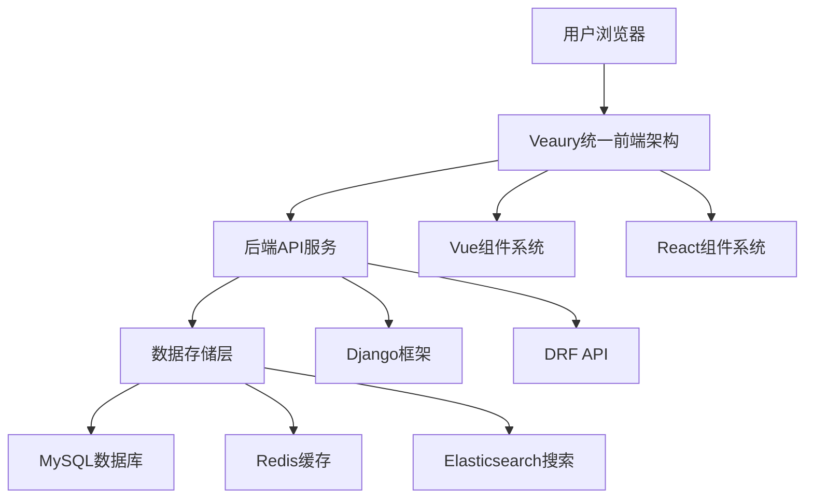

# 百度贴吧项目技术架构文档

## 1. 项目概述

### 1.1 项目背景
百度贴吧是全球最大的中文社区，本项目旨在开发一个功能完善的贴吧Web应用程序，为用户提供交流、分享、讨论的平台。

### 1.2 技术目标
- 构建高性能、可扩展的Web应用系统
- 采用现代化技术栈，确保技术先进性
- 实现前后端分离架构，提高开发效率
- 保障系统安全性和稳定性

## 2. 技术栈选型

### 2.1 前端技术栈

#### 核心框架
- **Veaury (Vue + React 混合编程框架)** - 创新性混合开发框架
- **Vue 3.3.0** - 渐进式JavaScript框架
- **React 18.2.0** - 用户界面构建库

#### 前端生态依赖
```json
{
  "veaury": "^2.6.0",
  "vue": "^3.3.0",
  "react": "^18.2.0", 
  "react-dom": "^18.2.0",
  "@vitejs/plugin-vue": "^4.4.0",
  "@vitejs/plugin-react": "^4.0.0",
  "vite": "^4.4.0"
}
```

#### Vue生态组件
```json
{
  "vue-router": "^4.2.0",
  "pinia": "^2.1.0",
  "element-plus": "^2.3.0",
  "@element-plus/icons-vue": "^2.1.0",
  "axios": "^1.4.0"
}
```

#### React生态组件
```json
{
  "react-router-dom": "^6.14.0",
  "zustand": "^4.4.0",
  "antd": "^5.8.0",
  "@ant-design/icons": "^5.2.0",
  "react-query": "^3.39.0"
}
```

### 2.2 后端技术栈

#### 核心框架
- **Django 4.2.0** - Python Web框架
- **Django REST Framework 3.14.0** - REST API框架

#### 后端依赖包
```python
Django==4.2.0
djangorestframework==3.14.0
mysqlclient==2.1.1
redis==4.5.0
celery==5.2.0
pillow==9.5.0
```

### 2.3 数据存储层
- **MySQL 8.0** - 关系型数据库
- **Redis** - 内存数据存储，用于缓存和会话管理
- **Elasticsearch** - 全文搜索引擎（可选）

### 2.4 文件存储
- **本地存储** - 开发环境使用
- **CDN** - 生产环境静态资源分发

## 3. 系统架构设计

### 3.1 整体架构图



### 3.2 前端架构详解

#### 3.2.1 Veaury混合架构优势
- **真正的组件级混合**：Vue和React组件无缝集成
- **零学习成本**：开发者无需学习对方框架语法
- **生态系统融合**：Vue和React生态完美结合
- **统一构建**：一套构建工具处理两个框架

#### 3.2.2 项目结构设计
```
src/
├── vue-components/          # Vue组件目录
│   ├── HomePage.vue        # 首页组件
│   ├── PostList.vue        # 帖子列表
│   ├── UserProfile.vue     # 用户中心
│   └── SearchPage.vue      # 搜索页面
│
├── react-components/       # React组件目录
│   ├── RichEditor.jsx      # 富文本编辑器
│   ├── RealTimeChat.jsx    # 实时聊天
│   ├── DataVisualization.jsx # 数据可视化
│   └── ImageUpload.jsx     # 图片上传组件
│
├── pages/                   # 混合页面
│   ├── CreatePost.vue      # 发帖页面(Vue+React混合)
│   └── PostDetail.vue      # 帖子详情(Vue+React混合)
│
└── main.js                  # Veaury应用入口
```

#### 3.2.3 构建配置
```javascript
// vite.config.js
import { defineConfig } from 'vite'
import vue from '@vitejs/plugin-vue'
import react from '@vitejs/plugin-react'
import veauryVitePlugin from 'veaury/vite'

export default defineConfig({
  plugins: [
    vue(),
    react(),
    veauryVitePlugin({
      // Veaury配置选项
      vueOptions: {},
      reactOptions: {}
    })
  ],
  resolve: {
    alias: {
      '@': '/src'
    }
  }
})
```

### 3.3 后端架构详解

#### 3.3.1 Django应用结构
```
backend/
├── users/                   # 用户管理应用
├── posts/                   # 帖子管理应用
├── tiebas/                  # 贴吧管理应用
├── search/                  # 搜索功能应用
├── messages/                # 消息系统应用
└── config/                  # 项目配置
```

#### 3.3.2 API设计规范
- **RESTful API设计**：遵循REST原则
- **JWT认证**：基于令牌的身份验证
- **权限控制**：基于角色的访问控制
- **数据验证**：输入数据严格验证

## 4. 数据库设计

### 4.1 核心数据表结构

#### 4.1.1 用户表 (user)
```sql
CREATE TABLE user (
    id BIGINT PRIMARY KEY AUTO_INCREMENT,
    username VARCHAR(50) UNIQUE NOT NULL,
    email VARCHAR(100) UNIQUE,
    phone VARCHAR(20) UNIQUE,
    password_hash VARCHAR(255) NOT NULL,
    avatar VARCHAR(255),
    nickname VARCHAR(50),
    gender TINYINT DEFAULT 0,
    birthday DATE,
    status TINYINT DEFAULT 1,
    created_at TIMESTAMP DEFAULT CURRENT_TIMESTAMP,
    updated_at TIMESTAMP DEFAULT CURRENT_TIMESTAMP ON UPDATE CURRENT_TIMESTAMP
);
```

#### 4.1.2 贴吧表 (tieba)
```sql
CREATE TABLE tieba (
    id BIGINT PRIMARY KEY AUTO_INCREMENT,
    name VARCHAR(100) UNIQUE NOT NULL,
    description TEXT,
    avatar VARCHAR(255),
    owner_id BIGINT NOT NULL,
    category_id INT,
    member_count INT DEFAULT 0,
    post_count INT DEFAULT 0,
    status TINYINT DEFAULT 1,
    created_at TIMESTAMP DEFAULT CURRENT_TIMESTAMP,
    FOREIGN KEY (owner_id) REFERENCES user(id)
);
```

#### 4.1.3 帖子表 (post)
```sql
CREATE TABLE post (
    id BIGINT PRIMARY KEY AUTO_INCREMENT,
    title VARCHAR(255) NOT NULL,
    content TEXT NOT NULL,
    author_id BIGINT NOT NULL,
    tieba_id BIGINT NOT NULL,
    view_count INT DEFAULT 0,
    reply_count INT DEFAULT 0,
    like_count INT DEFAULT 0,
    is_top TINYINT DEFAULT 0,
    is_essence TINYINT DEFAULT 0,
    status TINYINT DEFAULT 1,
    created_at TIMESTAMP DEFAULT CURRENT_TIMESTAMP,
    FOREIGN KEY (author_id) REFERENCES user(id),
    FOREIGN KEY (tieba_id) REFERENCES tieba(id)
);
```

#### 4.1.4 评论表 (comment)
```sql
CREATE TABLE comment (
    id BIGINT PRIMARY KEY AUTO_INCREMENT,
    content TEXT NOT NULL,
    author_id BIGINT NOT NULL,
    post_id BIGINT NOT NULL,
    parent_id BIGINT DEFAULT 0,
    floor_number INT NOT NULL,
    like_count INT DEFAULT 0,
    status TINYINT DEFAULT 1,
    created_at TIMESTAMP DEFAULT CURRENT_TIMESTAMP,
    FOREIGN KEY (author_id) REFERENCES user(id),
    FOREIGN KEY (post_id) REFERENCES post(id)
);
```

### 4.2 索引优化策略
- **主键索引**：所有表的主键索引
- **外键索引**：关联查询优化
- **复合索引**：常用查询字段组合
- **全文索引**：搜索功能优化

## 5. API接口设计

### 5.1 用户相关接口

| 方法 | 路径 | 描述 | 认证要求 |
|------|------|------|----------|
| POST | `/api/auth/register/` | 用户注册 | 无需认证 |
| POST | `/api/auth/login/` | 用户登录 | 无需认证 |
| GET | `/api/auth/logout/` | 用户登出 | 需要认证 |
| GET | `/api/auth/profile/` | 获取用户信息 | 需要认证 |
| PUT | `/api/auth/profile/` | 更新用户信息 | 需要认证 |

### 5.2 帖子相关接口

| 方法 | 路径 | 描述 | 认证要求 |
|------|------|------|----------|
| GET | `/api/posts/` | 获取帖子列表 | 可选认证 |
| POST | `/api/posts/` | 创建帖子 | 需要认证 |
| GET | `/api/posts/{id}/` | 获取帖子详情 | 可选认证 |
| PUT | `/api/posts/{id}/` | 更新帖子 | 需要认证 |
| DELETE | `/api/posts/{id}/` | 删除帖子 | 需要认证 |
| POST | `/api/posts/{id}/like/` | 点赞帖子 | 需要认证 |

### 5.3 贴吧相关接口

| 方法 | 路径 | 描述 | 认证要求 |
|------|------|------|----------|
| GET | `/api/tiebas/` | 获取贴吧列表 | 无需认证 |
| POST | `/api/tiebas/` | 创建贴吧 | 需要认证 |
| GET | `/api/tiebas/{id}/` | 获取贴吧详情 | 无需认证 |
| PUT | `/api/tiebas/{id}/` | 更新贴吧信息 | 需要认证 |

## 6. 技术特色与创新

### 6.1 Veaury框架创新优势

#### 6.1.1 技术独特性
- **国内首个**真正实现Vue+React无缝混合的开发框架
- **GitHub Stars**: 3.2k+（快速增长的社区支持）
- **基于Vue 3 Composition API**设计思想

#### 6.1.2 与传统方案对比

**传统方案 (Module Federation)缺点：**
- ❌ 复杂的配置：需要配置多个webpack实例
- ❌ 通信困难：组件间通信需要复杂的桥接层
- ❌ 体积较大：运行时需要加载两个完整框架
- ❌ 调试复杂：开发工具切换困难

**Veaury方案优势：**
- ✅ 简单易用：一个框架统一管理，配置简单
- ✅ 无缝通信：组件间直接通信，如同一框架
- ✅ 体积优化：智能代码分割和依赖共享
- ✅ 调试便捷：一套开发工具，统一调试体验

### 6.2 性能优化策略

#### 6.2.1 前端性能优化
- **代码分割**：路由级别的懒加载
- **组件级优化**：条件渲染和Props优化
- **缓存策略**：浏览器缓存和Service Worker
- **图片优化**：WebP格式和懒加载

#### 6.2.2 后端性能优化
- **数据库优化**：索引优化和查询优化
- **缓存策略**：Redis多级缓存
- **异步处理**：Celery任务队列
- **CDN加速**：静态资源分发

### 6.3 安全架构设计

#### 6.3.1 认证与授权
- **JWT令牌**：无状态身份验证
- **权限控制**：基于角色的访问控制
- **会话管理**：安全的会话存储机制

#### 6.3.2 数据安全
- **SQL注入防护**：参数化查询
- **XSS防护**：输入输出过滤
- **CSRF防护**：令牌验证机制
- **数据加密**：敏感信息加密存储

## 7. 开发环境配置

### 7.1 前端开发环境
```json
{
  "node": ">=16.0.0",
  "npm": ">=8.0.0",
  "开发工具": "VSCode + Vue/React DevTools"
}
```

### 7.2 后端开发环境
```json
{
  "python": ">=3.8",
  "django": "4.2.0",
  "数据库": "MySQL 8.0 + Redis",
  "开发工具": "PyCharm + Django Debug Toolbar"
}
```

### 7.3 构建与部署
- **构建工具**：Vite + Veaury插件
- **打包优化**：Tree Shaking + 代码压缩
- **部署方式**：Docker容器化部署

## 8. 部署架构

### 8.1 开发环境部署
- **本地开发服务器**：Vite开发服务器
- **数据库**：本地MySQL + Redis
- **API服务**：Django开发服务器

### 8.2 生产环境部署
- **Web服务器**：Nginx反向代理
- **应用服务器**：Gunicorn + Django
- **数据库**：MySQL主从复制
- **缓存**：Redis集群
- **文件存储**：CDN + 对象存储

### 8.3 监控与运维
- **日志管理**：ELK日志收集
- **性能监控**：APM工具监控
- **错误追踪**：Sentry错误监控
- **健康检查**：服务健康状态检查

## 9. 技术演进规划

### 9.1 短期优化（1-3个月）
- **TypeScript迁移**：增强代码类型安全
- **PWA支持**：离线功能和原生体验
- **性能优化**：进一步优化加载速度

### 9.2 中期扩展（3-6个月）
- **微服务架构**：服务拆分和独立部署
- **实时通信**：WebSocket实时消息
- **AI功能**：智能推荐和内容分析

### 9.3 长期规划（6-12个月）
- **多端适配**：移动端App开发
- **国际化**：多语言支持
- **云原生**：Kubernetes容器编排

## 10. 技术债务与改进方向

### 10.1 当前技术债务
- **代码规范**：需要统一的代码规范检查
- **测试覆盖**：单元测试和集成测试覆盖不足
- **文档完善**：API文档和技术文档需要完善

### 10.2 改进方向
- **自动化测试**：建立完整的测试体系
- **CI/CD流水线**：自动化构建和部署流程
- **性能监控**：建立完善的性能监控体系
- **安全审计**：定期安全漏洞扫描和修复

## 11. 总结

本项目技术架构采用现代化的技术栈，特别是创新的Veaury混合框架，实现了Vue和React生态的完美融合。架构设计注重性能、安全性和可扩展性，为项目的长期发展奠定了坚实的技术基础。

通过前后端分离的架构设计、完善的数据库设计和API规范，确保了系统的稳定性和可维护性。同时，技术演进规划为项目的未来发展提供了清晰的方向。

该技术架构文档可作为项目开发的技术指导手册，为开发团队提供全面的技术参考和实现指导。