# 百度贴吧项目文档可视化

## 项目结构可视化

### 1. 项目文件组织结构图
```mermaid
graph TD
    A[百度贴吧项目] --> B[核心页面文件]
    A --> C[样式资源文件]
    A --> D[JavaScript文件]
    A --> E[项目文档]
    
    B --> B1[index.html 首页]
    B --> B2[auth.html 登录注册]
    B --> B3[profile.html 个人中心]
    B --> B4[tieba-detail.html 贴吧详情]
    B --> B5[post-detail.html 帖子详情]
    B --> B6[search.html 搜索页面]
    B --> B7[messages.html 消息中心]
    B --> B8[create-tieba.html 创建贴吧]
    B --> B9[create-post.html 发帖页面]
    B --> B10[settings.html 用户设置]
    
    C --> C1[css/style.css 样式文件]
    
    D --> D1[js/script.js 脚本文件]
    
    E --> E1[项目分析文档.md]
    E --> E2[功能思维导图.md]
    E --> E3[页面调用关系图.md]
    E --> E4[页面功能测试报告.md]
    E --> E5[项目技术架构文档.md]
```

### 2. 页面功能模块关系图
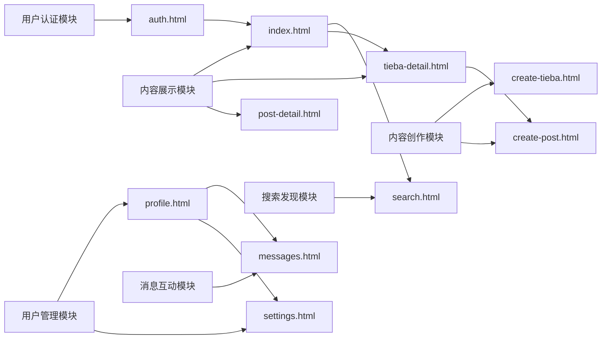

### 3. 技术架构层次图
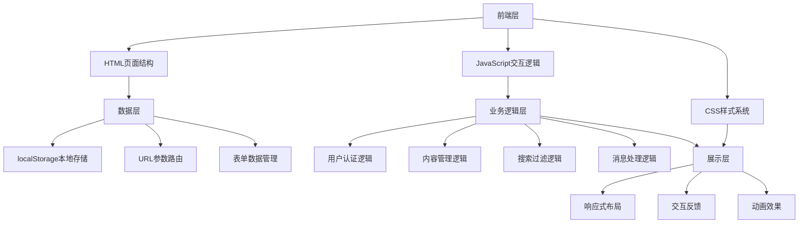

## 功能模块可视化

### 4. 用户功能流程图
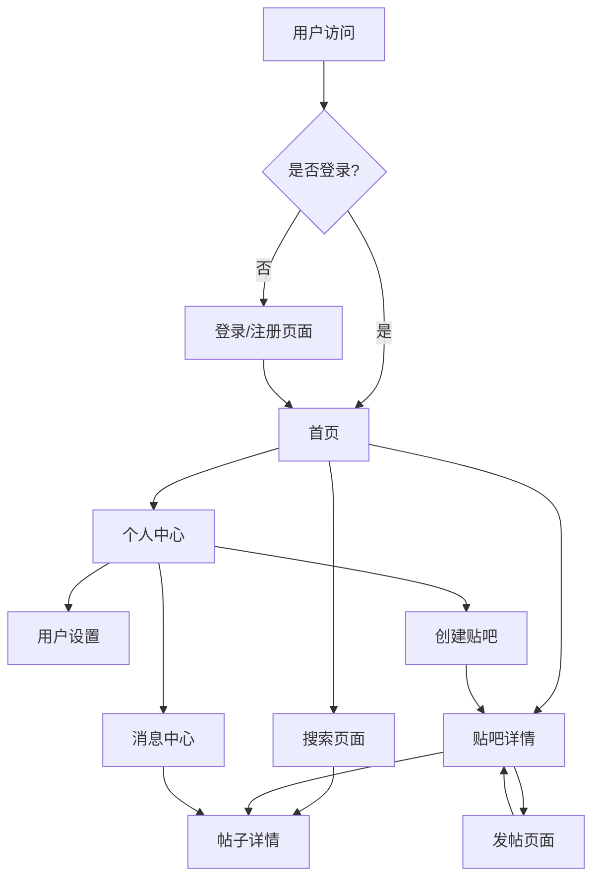

### 5. 内容创作流程图
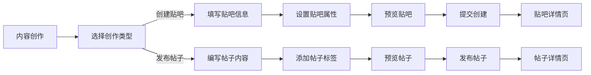

## 数据流向可视化

### 6. 用户数据流向图
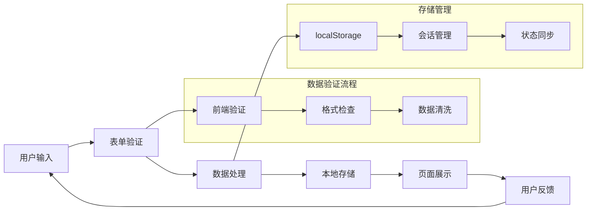

### 7. 页面状态管理图
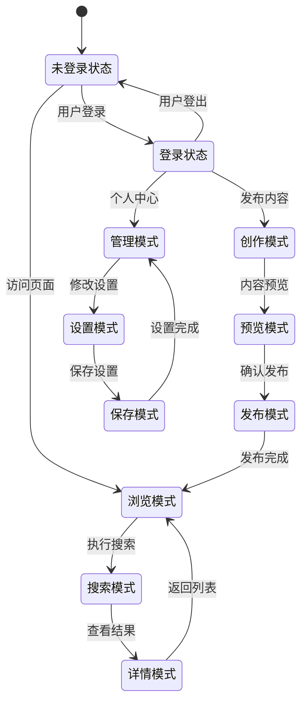

## 交互流程可视化

### 8. 搜索功能交互图
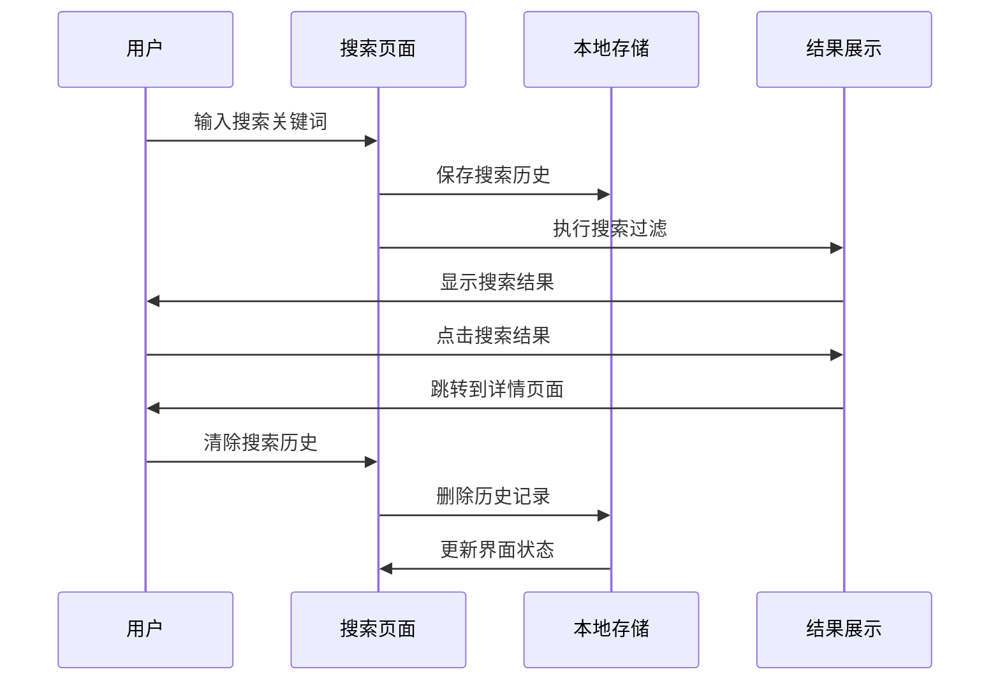

### 9. 消息系统交互图
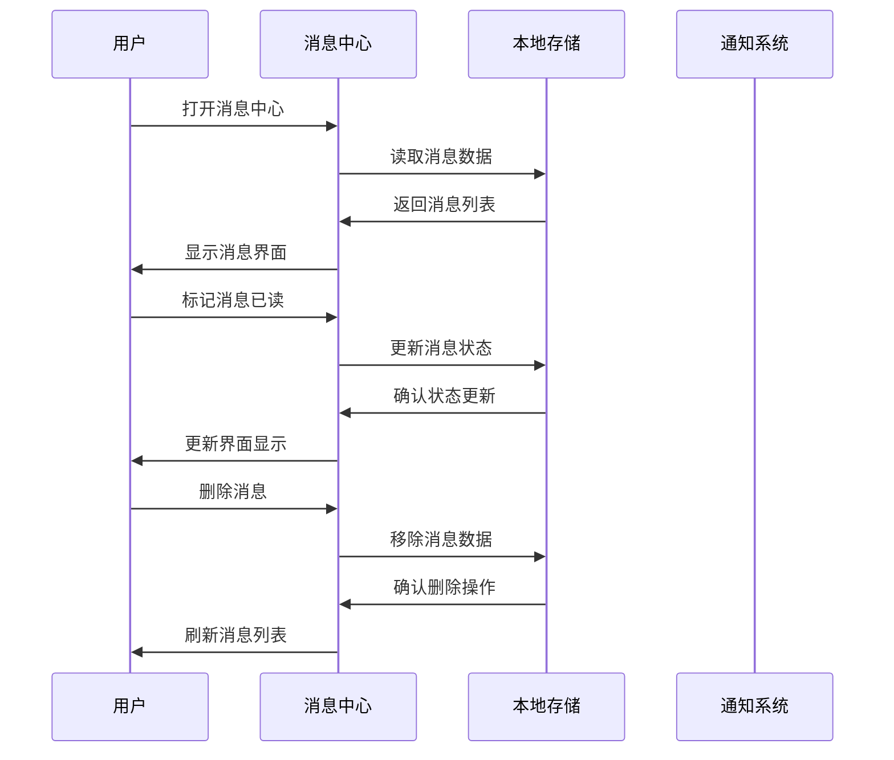

## 技术特性可视化

### 10. 响应式设计适配图
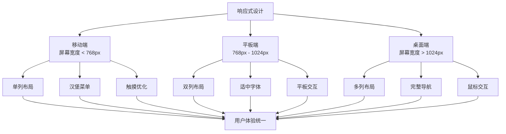

### 11. CSS样式系统架构图
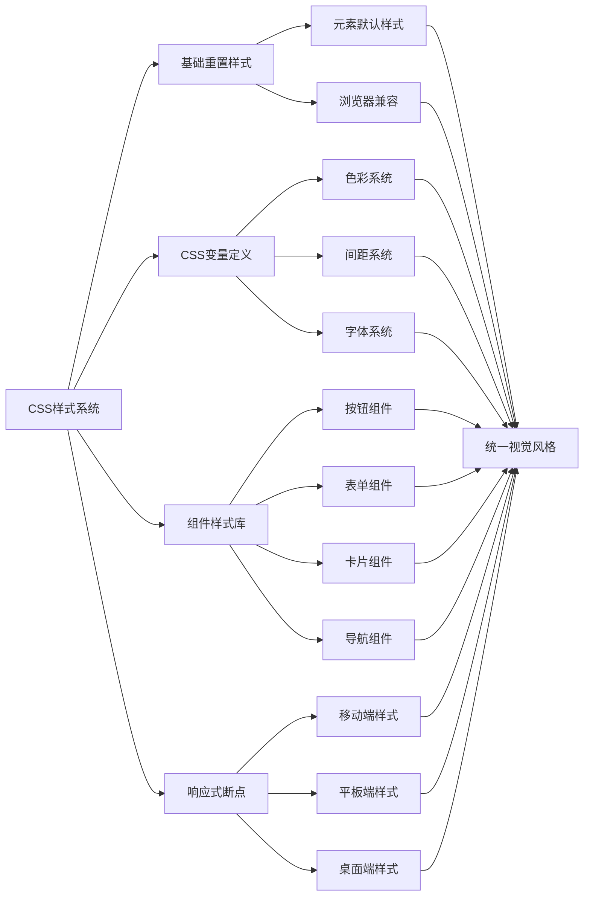

## 项目进度可视化

### 12. 项目开发进度甘特图
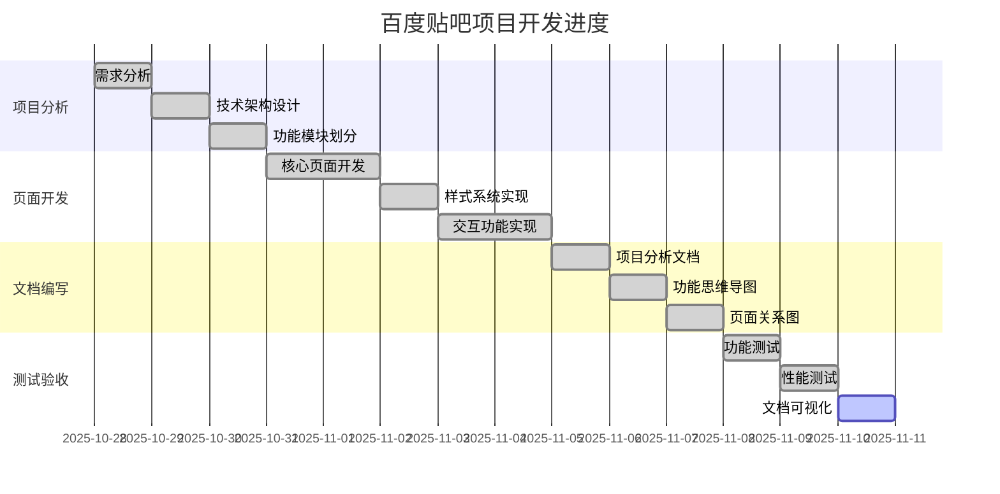

## 使用说明

这些可视化图表可以帮助您：

1. **快速理解项目结构** - 通过架构图了解整体设计
2. **掌握功能流程** - 通过流程图理解用户操作路径
3. **分析数据流向** - 通过数据图了解信息传递过程
4. **评估技术实现** - 通过技术图了解系统特性
5. **跟踪项目进度** - 通过甘特图了解开发状态

所有图表都使用Mermaid语法编写，可以在支持Mermaid的Markdown查看器中直接渲染显示。